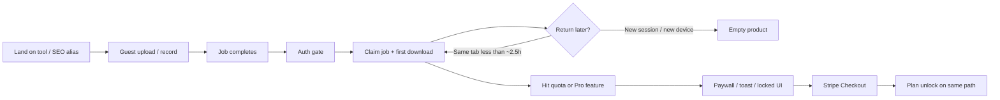

# Funnel friction: activation → second session → paywall → paid conversion

**Shipped in this PR (product code):** Magic login now writes the same `authToken` / `userId` keys as password login; job sessions key by engine (`toolKey`) so SEO aliases can resume; quota copy is daily for guests and monthly for signed-up Free; product CTAs no longer promise YouTube URL paste; export/batch limits open `PaywallModal`; Voice and Guideline persist jobs; login/onboarding copy is honest; onboarding emails target last-used tool and return users; rescue email uses geo/event price instead of hardcoded `$7.99`.

**Still open:** SEO alternative-page YouTube claims, consumer job library, re-enable YouTube ingest, `business_conversion` metrics.

**Scope:** every public surface that users treat as a “core tool” — 9 processing engines, their SEO aliases, guideline hubs, and free browser utilities.  
**Method:** code-path audit of client + server + crons + GSC (2026-08-13 → 2026-09-09). Not a live cohort study: `business_conversion` is still unbuilt, so this is a friction map, not a conversion-rate report.  
**Canonical quota (code, 2026-09):** guests = **3 imports / IP / UTC day**; signed-up Free = **3 imports / calendar month** (1st UTC); Pro = no hard import cap, 120 min / 10 GB, batch 20.  
**Related:** [ACTIVATION_FRICTION_RANKING.md](./ACTIVATION_FRICTION_RANKING.md) (short P0–P2 list), [analytics/METRICS.md](./analytics/METRICS.md) (activation = first completed job within 24h of signup).

---

## 0. What “89 core tools” actually is

VideoText does **not** have 89 distinct processing engines. It has **nine engines** and a large catalog of URLs that render those engines (or never enter the paid funnel at all).

| Layer | Count | What the user actually runs |
| --- | ---: | --- |
| Processing engines (money pages) | 9 | One React page + one backend `toolType` each |
| SEO registry entries | 256 | Same 9 engines (or a guideline article) under another URL |
| Indexable registry pages | 202 | Search-visible aliases of those engines |
| Free browser utilities (`/tools/*`) | 20 | Client-side only — **no import, no paywall, no Stripe** |
| Routes inventory | 215 | Mix of engines, aliases, legal, hubs |

Registry mix by `toolKey`:

| Engine | Registry pages | Primary path |
| --- | ---: | --- |
| `video-to-transcript` | 135 | `/video-to-transcript` |
| `video-to-subtitles` | 42 | `/video-to-subtitles` |
| `voice-to-text` | 19 | `/voice-recorder` |
| `brand-guideline` | 37 | `/guideline-format` |
| `translate-subtitles` | 6 | `/translate-subtitles` |
| `fix-subtitles` | 6 | `/fix-subtitles` |
| `burn-subtitles` | 5 | `/burn-subtitles` |
| `batch-process` | 4 | **redirects** to `/video-to-transcript` |
| `compress-video` | 2 | `/compress-video` |

Friction is therefore **not** 89 unique funnels. It is **one shared four-stage funnel**, with **nine engine-specific deviations**, then **URL-level intent mismatch** on every SEO alias. Section 8 scores all 89 highest-leverage public surfaces against that model.

---

## 1. The shared funnel (what every engine is supposed to do)

**Activation (product definition):** first completed job within 24h of *signup* (`METRICS.md`). Guests who finish a job but bounce at the auth gate are **not** activated.

**Second session:** any later visit after the first completed job. Structurally, VideoText is privacy-first and **session-ephemeral** — there is no “my jobs” library.

**Paywall:** `PaywallModal` plus toast / locked chips / `ProCheckoutLink`. Most reasons fire *before* upload (quota, length) or *after* result (copy, export, AI, edit).

**Paid conversion:** `startCheckout` → Stripe → `?payment=success` → `PostCheckoutHandler` writes JWT + plan. Authoritative paying state is Stripe webhook → `User.plan`, not the checkout click.

---

## 2. Stage 1 — Activation

### 2.1 What works

- Guests **can** start work without an account on every engine except batch (server requires auth).
- Guest identity is `guest_<uuid>` at upload; IP cap is 3/day (`server/src/utils/guestIpLimit.ts`).
- Most engines persist `jobId` + `jobToken` to `?jobId=` and `sessionStorage` (`client/src/lib/jobSession.ts`).
- After signup, `POST /api/jobs/:jobId/claim` attaches the guest job and increments `importCount`.

### 2.2 Shared activation friction (all engines)

1. **Value is hidden at the highest-intent moment.** On job complete, guests get `requiresAuth: true` and **no result payload** (`server/src/routes/jobs.ts`). The UI shows a teaser + blocking `JobAuthGateModal` (`dismissable={false}`). The user paid with time (upload + wait) and then hits a wall.

2. **Signup is two steps after that wall:** email + password → OTP email → create account. Google is available when `GOOGLE_CLIENT_ID` is set. Returning users with a password who land on the OTP path get **409 “Account already exists. Please log in.”**

3. **Quota copy is wrong in three places at once.**
   - Modal unused `choice` view: “2 free imports left **today**”.
   - Paywall reason enum: `FREE_DAILY_LIMIT_REACHED` (used everywhere).
   - Paywall body + server for logged-in Free: **3 / month**.
   - Guest server message: **3 / day, midnight UTC**.
   - Promoter briefing in Notion still says signed-up Free is **3 / day**.
   - Deprecated alias `getMaxDailyImports()` now returns the monthly cap (`limits.ts`).

4. **YouTube / URL promise is broken on the highest-intent acquisition cluster.** `/youtube-transcript-generator` and eight sibling routes **redirect** to `/video-to-transcript`. That page hard-locks `inputMode` to file (`VideoToTranscript.tsx`). Activation wizard still says “paste URL.” Onboarding email still says “paste a YouTube URL.” GSC: `/youtube-transcript-generator` = **25 clicks / 2,435 impressions**, position ~56 — people arrive, then cannot do the job they searched for.

5. **Choice overload before first action.** Primary nav is a large tools menu (`CORE_AI_TOOLS_NAV` + SEO aliases). First-time users from `/` or a comparison page must pick among 8–9 tools before the first upload.

### 2.3 Engine-specific activation friction

| Engine | Pre-auth start? | What guest sees at “done” | Unique activation tax |
| --- | --- | --- | --- |
| Video → Transcript | Yes | Locked chips, **no transcript text** | Richest workspace (summary/chapters/speakers) all hidden; live partials are logged-in only; YouTube tab dead |
| Video → Subtitles | Yes | Teaser, no cues | Studio / QC / bilingual only after login |
| Translate (SRT job) | Yes | No preview | Dual-mode page; language pick before value |
| Translate (DOCX/TXT) | Yes (no job) | Translation computed then **hidden** | Daily localStorage cap (3/day) vs UI “per month”; wasted API work |
| Fix Subtitles | Yes | Modal on **analyze**, issues list never shown | Optional dual upload (SRT + video); analyze value is login-gated |
| Burn Subtitles | Yes if **both** files | “Sign up to download” — no preview | Dual-file tax; 3–5 min wait then wall |
| Compress Video | Yes | Savings card; download gated after **3s** | Brief result flash, then teaser |
| Voice → Text | Yes (mic) | **Full transcript for ~3s**, then gate | Mic permission; Deepgram path can show text with no `jobId` |
| Guideline Format | Yes | No output text | Longest pre-value path (paste → preset/rules → format); **no `persistJobId`** — reload loses the job |
| Batch | **No** | — | Route is `<Navigate to="/video-to-transcript">`; server requires auth + Pro |

### 2.4 Activation verdict

The product activates **compute** before it activates **the user**. Guests burn an IP-day import and GPU/Whisper time, then are asked for email + OTP before they can confirm the output is good. Voice and (briefly) Compress are the only engines that show real output first — and Voice can then fail quota with no durable job.

For SEO aliases of transcript/subtitles, activation is worse: the page title promised a specific job (YouTube URL, CapCut JSON, Vimeo, French, etc.) and the engine then asks for a **file upload** that may not match the intent.

---

## 3. Stage 2 — Second session

This is the most structurally broken stage. Privacy positioning (“we don’t store your data”) and return-user UX are in direct conflict.

### 3.1 What a returning user actually has

| Store | Survives a later visit? |
| --- | --- |
| Output files on disk (`TEMP_FILE_PATH`) | ~**2.5 hours** (30 min under disk pressure) |
| Bull job in Redis | Until eviction; 404 → `SessionExpiredError` (“Please upload again”) |
| Postgres `Job` row | Metadata only — **no transcript body** |
| `sessionStorage` `job-{first-url-segment}` | Same tab / same path, not a new device |
| localStorage transcript edits | Same `jobId` **and** a still-loadable Bull job |
| `TranscriptShare` | Yes — full payload in Postgres (user-opt-in) |
| Duplicate cache | Same user + same file hash + same process + file still on disk |
| Consumer “My jobs” UI | **Does not exist** |

Login marketing copy is false:

> “Your transcripts are waiting… Log in to access your transcripts… continue where you left off.” (`Login.tsx`)

There is nothing waiting. Founder support can list last 20 jobs; API v1 can list transcriptions for API-key users; the web Free/Pro user cannot.

### 3.2 Email is the intended second-session channel — and it is miswired

**Free onboarding** (`onboardingEmailCron.ts`):

- Only `plan: free` with `importCount === 0` and `< 2` jobs.
- Users who activated as guests then signed up (import already counted) **never get the sequence**.
- Every CTA is `/video-to-transcript`, even if they used Voice, Translate, Fix, or Burn.
- Copy still promises YouTube paste.
- Button label is the raw path: “Open /video-to-transcript”.
- Windows: 3–6h, day 1, day 3, day 7. Gated on `ONBOARDING_EMAILS_ENABLED`.

**Pro onboarding:** day-1 CTA is `/batch-process` (a redirect). Day-7 CTA is `/translate-subtitles`. Same magic-link bug as free.

**Magic login is broken.** `MagicLogin.tsx` writes `auth_token` / `user_id` / `plan`. The app reads `authToken` / `userId` / `plan` via `storeLoginResult()`. Email return users land **logged out** for API calls. This is a P0 for every cron that uses `/magic-login`.

**`lastActiveAt`** updates only on worker job completion — not login, download, or email click. Retention targeting cannot see “came back and bounced.”

**`guestJobUsed`** is written on signup/auth-gate and **never read**.

### 3.3 Cross-tool second session is disabled

The intended Pro loop is transcribe → fix → translate → burn → share. In code:

- `CrossToolSuggestions` on **Video → Transcript is commented out**.
- Workflow pre-fill handlers (`useWorkflowVideo`) are commented on transcript, burn, compress.
- `emitToolCompleted` is commented on subtitles.
- `WorkflowTracker` is commented out in `App.tsx`.
- Job session keys are the **first path segment**, so `/video-to-srt` and `/video-to-transcript` do **not** share rehydration state.

A user who activated on an SEO alias cannot resume on the money page. A user who finished a transcript cannot hand the file to Fix/Burn. Second session is a **cold start** plus a **re-upload**.

### 3.4 Engine-specific second-session notes

| Engine | Rehydrate? | After ~3h | Extra return leak |
| --- | --- | --- | --- |
| Transcript | Yes, path-scoped | Session expired | Local edits die with the job; share links are the only durable text |
| Subtitles | Yes | Same | No cross-tool emit |
| Translate job | Yes | Same | Document tab is memory-only |
| Fix / Burn / Compress | Yes | Same | Links exist, pre-fill dead |
| Voice | **No** `persistJobId` | Nothing | Must re-record |
| Guideline | **No** persist | Job lost on refresh | Separate claim endpoint; daily quota error says “per month” |
| Batch | Redirect | — | No dedicated history |
| SEO alias | Yes **on that URL only** | Same | Canonical redirect drops `?jobId=` |
| Free `/tools/*` | Browser only | N/A | Never creates an account to return *to* |

### 3.5 Second-session verdict

Activation that does not persist cannot compound. The privacy promise is a real differentiator (agencies, client media) and a **conversion killer** for anyone whose second visit is “where is yesterday’s file?” Paid conversion in this category of tool usually happens on **job 2–4**, not job 1. VideoText resets the user to job 0.

---

## 4. Stage 3 — Paywall

### 4.1 When the wall appears

| Trigger | Timing | Modal? | Typical engines |
| --- | --- | --- | --- |
| Import quota exhausted | Before next upload | Yes (often no `reason` / misnamed daily) | All job engines |
| Video > 30 min | Before upload | `VIDEO_TOO_LONG` | Transcript, Subtitles |
| 4th clipboard copy | After result | `COPY_LIMIT_REACHED` | Transcript |
| AI summary teaser | After result | `AI_FEATURES` | Transcript |
| Inline edit | After result | `INLINE_EDIT` | Subtitles, Fix |
| PDF / Word | After result | Yes on **Fix only**; toast on Transcript | Fix vs Transcript inconsistency |
| 3rd free download | After result | **Toast only** (2-cap) | Transcript, Subtitles, Burn, Compress, Fix |
| Multi-file select | Before | **Toast + first file only** — `BATCH_NOT_AVAILABLE` never shown | Transcript |
| Extra languages | Server 403 | `MULTI_LANGUAGE_NOT_AVAILABLE` **never wired** | Subtitles |
| Doc translate 3/day | Before | `DOCUMENT_TRANSLATION_LIMIT` | Translate documents |
| Voice quota | Before record **or after** live transcript | `FREE_DAILY_LIMIT_REACHED` | Voice |
| Guideline 3/period | Before format | **No PaywallModal** — 429 string | Guideline |

Unused reasons in the type system: `FREE_MONTHLY_LIMIT_REACHED` (never set), `BATCH_NOT_AVAILABLE`, `MULTI_LANGUAGE_NOT_AVAILABLE`, `VTT_EXPORT`, `TRANSLATED_EXPORT`, `SHARING`.

### 4.2 Shared paywall friction

1. **Reactive, not progressive.** Quota education appears at cutoff. Remaining-imports UI exists on some upload zones; expectation-setting is inconsistent across SEO aliases.

2. **“Resets on the 1st” / “resets at midnight” teaches users to wait.** For a 1–2 job/week creator, monthly 3 is enough to **never** see a quota wall. Notion *Revenue Gaps* (2026-03) already called this; the code later moved Free from daily → monthly, which **widens** the “good enough forever” hole for casual users.

3. **Export exhaustion is a toast, not a checkout.** Peak-intent moment (file ready, user clicking Download again) does not open `PaywallModal` on the main transcript tool. They have to find Pricing or a banner.

4. **Watermark is on text, not video.** Client delivery ICPs will upgrade to remove it. Casual users can still read / copy (until copy cap) and ship a usable SRT with a footer they delete.

5. **Attribution names disagree.** Same engine is logged as `video-to-transcript` / `transcript` / `voice` / `fix-srt` / `fix-subtitles`. Founder conversion-intent and rescue email personalization cannot roll up cleanly.

6. **Rescue email hardcodes `$7.99`** (`pricingIntentRescueCron.ts`) and ignores PPP / GBP / EUR geo tiers.

### 4.3 Paywall verdict

The wall is strongest on **length** (30 min) and **client-delivery exports** (watermark, PDF/DOCX, batch). It is weakest on **casual short-file users** (monthly quota never hits) and **free-tool visitors** (never enter the wall). Several of the best paywall reasons exist only as copy.

---

## 5. Stage 4 — Paid conversion

### 5.1 Checkout path (shared)

`startCheckout` → `upgrade_clicked` + `checkout_started` → Stripe session → `checkout_session_created` + `stripe_redirect` → `window.location.assign`.

- Anonymous checkout is allowed; Stripe can collect email. Logged-in users skip OTP.
- `returnToPath` is the current pathname. Success URL **replaces** query string, so `?jobId=` is lost; `sessionStorage` usually still has the job **if the same tab**.
- Cancel: `CheckoutCancelledHandler` retry modal.
- After success: full-screen “activating plan” overlay, then optional **password-setup modal**, then stripped URL. Plan is already in `localStorage` before those modals finish.

### 5.2 Conversion friction

1. **Password modal after they already paid** — extra step at the moment they want the download.

2. **Job may still be gone** if they paid from a different device, after file TTL, or from a quota-before-upload wall (no job existed).

3. **Voice Deepgram quota race:** transcript on screen, no `jobId`, checkout cannot restore a job that was never registered.

4. **Pricing page has no `tool` attribution** — SEO-origin paid conversions collapse to “pricing”.

5. **`/pro-access` and `/demo` → pro-access** create a side path of uncapped demo-shaped access (historically polluted paid-conversion metrics; taxonomy work exists, dashboard still mixed).

6. **Geo price vs rescue copy:** PPP user sees ~$3.99 in-app, then an email that says $7.99.

### 5.3 Paid-conversion verdict

Checkout itself is relatively clean (anonymous Stripe, geo tiers, cancel recovery). The leak is **upstream**: many high-intent users never reach a paywall with a preserved job and a matching promise (YouTube, batch, free-tool CTA). Those who do can still lose the job on return.

---

## 6. Per-engine deep cuts

### 6.1 Video → Transcript — primary money engine

**Why it matters:** Hub for 135 SEO pages + batch + most onboarding CTAs. GSC on the *canonical* URL is only **24 clicks**; aliases carry the traffic (`/video-to-srt` 264, `/srt-generator` 258).

**Activation:** File-only despite YouTube cluster. Auth gate hides the entire workspace. Copy is login-gated then 3/session then paywall — this is the one engine that actually implemented the March “gate copy” fix.

**Second session:** Best-in-class local edit persistence — useless once Bull/files die. Cross-tool suggestions disabled on the page that should start the Pro workflow.

**Paywall:** Strongest surface (quota, length, copy, AI teaser, export toast, upgrade banner, second-job nudge). Inconsistent: PDF on this engine is toast; on Fix it is a modal.

**Paid:** Job usually survives same-tab checkout. Free user who never exceeds 30 min and never hits 4th copy may never see a hard wall.

**SEO overlay:** `/video-to-srt` and `/srt-generator` render this engine (or redirect into `/video-to-srt`). User wanted an SRT, not a transcript workspace. Extra chrome (summary/chapters) reads as upsell noise, not the job.

### 6.2 Video → Subtitles

**Activation:** Same guest → teaser → OTP pattern. No URL input.

**Second session:** No `CrossToolSuggestions` at all. Share panel exists if they created one.

**Paywall:** Quota + length + `INLINE_EDIT`. Multi-language is a Pro server gate with **no client modal**.

**SEO overlay:** `/capcut-captions` (69 clicks) is a special case — CapCut JSON helper plus exit to core tools. High intent, easy to dump users into file-upload transcript instead of the caption job they had.

### 6.3 Translate Subtitles

**Activation:** Two products in one page (SRT job vs document). Document path translates then hides output for guests.

**Second session:** Doc result is React state only.

**Paywall:** Split brain — subtitle jobs use monthly imports; docs use **3/day localStorage** with **no server enforcement**. UI still says “3 translations per month.”

**Paid:** High-intent localization ICP. Paywall copy is generic “unlimited imports,” not “keep timecodes + 70 languages.”

### 6.4 Fix Subtitles

**Activation:** Analyze-then-fix is the aha (overlaps, CPS, CPL). Guests never see the issue list.

**GSC:** `/subtitle-grammar-fixer` **41 clicks**, `/subtitle-line-break-fixer` **20** — these people arrived with a broken SRT and are asked to create an account before they see *what* is broken.

**Paywall:** Only engine that uses `PDF_EXPORT` / `WORD_EXPORT` modals. Attribution `tool="fix-srt"`.

### 6.5 Burn Subtitles

**GSC:** `/burn-subtitles-into-video` 82 + `/burn-subtitles` 74 — **strongest money-page traffic after SRT aliases.**

**Activation:** Dual upload is honest but heavy. Long encode, then signup for a file they cannot preview.

**Paywall:** Default monthly copy only — no “remove watermark from burned MP4” reason, even though that is the actual Pro hook.

**Paid:** Natural Pro job (client delivery). Friction is time-to-first-preview, not price.

### 6.6 Compress Video

Low registry coverage (2 pages). Activation is lighter (savings card). Weak Pro story (“unlimited imports”) — compression is a commodity; conversion should attach to the subtitle/transcript workflow, but pre-fill is commented out.

### 6.7 Voice → Text

**Activation:** Best first 10 seconds (mic, live captions). Worst claim (quota after recording, no job).

**Second session:** No `jobSession`. Must re-record.

**Paywall:** Hits after the aha. Checkout cannot restore the take.

**SEO:** 19 voice aliases. If they promised “voice memo to text,” a post-record wall feels like a bait-and-switch more than file-upload tools do.

### 6.8 Guideline Format + 37 brand pages

**Activation:** Highest step count before value. Reload drops the job. Quota error says month, counter is daily.

**Second session:** Brand guideline *articles* are content; only `/guideline-format` runs the engine. Spokes that are factually wrong (see `docs/seo/gotranscript-guidelines-verification-2026-09-12.md`) burn trust before the funnel starts.

**Paywall:** No `PaywallModal`. Freelancers who would pay for client-ready QA never get a Stripe-shaped moment.

**Paid:** Highest LTV ICP (Rev/GoTranscript freelancers) on the weakest conversion UI.

### 6.9 Batch

Not a tool. Redirect. Free multi-select silently processes **one file**. Pro email day-1 sends people here. Server `BATCH_NOT_AVAILABLE` never becomes a modal.

---

## 7. The free-tool leak (outside the funnel)

GSC (28 days) — **free utilities out-click the canonical transcript tool**:

| Path | Clicks | In the paid funnel? |
| --- | ---: | --- |
| `/tools/ttml-to-srt` | 166 | No |
| `/tools/video-metadata-viewer` | 88 | No |
| `/tools/subtitle-validator` | 33 | No |
| `/tools/subtitle-word-counter` | 19 | No |
| `/tools/merge-srt-files` | 13 | No |
| `/video-to-transcript` | 24 | Yes |

These 20 tools do the job entirely in-browser. That is correct for SEO and trust. It is fatal for this funnel if the only CTA is a generic “try AI transcription” that lands on file-upload transcript **after** the user already finished.

Notion *Revenue Gaps* (2026-03) already named this: every free tool must exit into a **matching** money job (validator → Fix, SRT extract → Transcript, TTML → Translate/Fix), not a homepage toolkit.

---

## 8. Friction scores for 89 public surfaces

Scoring (1 = low friction, 5 = blocks the stage). **Shared** scores apply unless an engine override is noted.

**Shared baseline (all 9 engines + their SEO aliases):** Activation 4, Second session 5, Paywall 3, Paid 3.

Overrides:

| Surface family | n | Act | S2 | Pay | Paid | Why it differs |
| --- | ---: | ---: | ---: | ---: | ---: | --- |
| YouTube / URL aliases → file-only transcript | 10 | **5** | 5 | 3 | 4 | Intent broken before upload |
| `/video-to-srt`, `/srt-generator` | 2 | 4 | 5 | 3 | 3 | High traffic, SRT-shaped, transcript chrome |
| `/video-to-transcript` canonical | 1 | 4 | 5 | 3 | 3 | Baseline money page |
| Video → Subtitles + caption SEO | 12 | 4 | 5 | 3 | 3 | Edit modal is better than transcript toast |
| `/capcut-captions` | 1 | 4 | 5 | 2 | 3 | Extra helper; easy to miss burn/fix exit |
| Translate + language SEO | 8 | 4 | 5 | **4** | 3 | Dual quota, hidden guest output |
| Fix + grammar/line-break SEO | 8 | **5** | 5 | 3 | 3 | Analyze value hidden |
| Burn + burn-into-video | 4 | 4 | 5 | 3 | **2** | High intent, dual-file tax only |
| Compress | 3 | 3 | 5 | 3 | 4 | Weak Pro story |
| Voice + 19 aliases | 20 | 3 | **5** | **4** | **4** | Aha then quota; no persist |
| Guideline + brand spokes | 38 | **5** | 5 | **4** | 4 | Long path, no modal, factual risk on spokes |
| Batch / bulk SEO | 4 | **5** | 5 | 4 | 3 | Redirect + silent single-file |
| Free `/tools/*` | 20 | **1** | **1** | **1** | **5** | Completes job; almost never converts |
| `/` + `/pricing` + hubs | — | 3 | 4 | 3 | 3 | Choice + weak tool attribution |

The **89-row catalog** (engines + free tools + guideline spokes + highest-traffic SEO aliases) is listed in [funnel-friction-89-surfaces.json](./funnel-friction-89-surfaces.json). Every row inherits its family’s scores; unique notes are on the row.

### 8.1 Traffic-weighted priority (GSC clicks × funnel leak)

These surfaces move the most people into a broken stage:

1. `/video-to-srt` + `/srt-generator` (522 clicks) — enter transcript engine; YouTube/file confusion; auth wall; no library.
2. `/tools/ttml-to-srt` + other free tools (~350+ clicks) — **never reach paywall**.
3. `/burn-subtitles*` (156 clicks) — best paid-intent cluster; dual-file + no preview.
4. `/capcut-captions` (69) — need a one-click exit to Fix/Burn, not a toolkit.
5. `/subtitle-grammar-fixer` + line-break (61) — Fix engine with analyze hidden.
6. YouTube cluster (25+ impressions-heavy) — redirect to file-only.
7. `/video-to-transcript` (24) — under-performs its own aliases.
8. `/translate-subtitles` (13) — quota copy split.
9. Voice cluster — activation-strong, retention-zero.
10. Guideline spokes — trust then a tool with no PaywallModal.

---

## 9. Cross-cutting contradictions (fix these once, they hit all 89)

| # | Contradiction | Stages hit |
| --- | --- | --- |
| 1 | Magic login writes the wrong localStorage keys | Second session, paid (email rescue) |
| 2 | Free quota is monthly in code, daily in enums, briefing, and guest IP | Activation, paywall, paid |
| 3 | YouTube advertised, file-only shipped | Activation (all YouTube/SEO surfaces) |
| 4 | Login promises a library; privacy deletes the library | Second session, paid |
| 5 | `jobSession` keyed by URL segment, not `toolKey` | Second session across ~200 aliases |
| 6 | Cross-tool / workflow pre-fill commented out | Second session, paid (Pro expansion) |
| 7 | Batch is a marketing tool and a redirect | Activation, paywall |
| 8 | Best PaywallReasons unused; export cap is a toast | Paywall, paid |
| 9 | Onboarding emails only hit `importCount === 0` and always deep-link transcript | Second session |
| 10 | Guideline / translate / voice have **separate** quota clocks | Paywall trust |

---

## 10. Ranked interventions (by funnel stage)

Do not treat these as a 14-day MRR fantasy. They are ordered by how many of the 89 surfaces they unblock.

### P0 — restore the loop

1. **Fix `MagicLogin.tsx` to call `storeLoginResult()`.** Every onboarding / Pro / rescue email is currently a dead return path.
2. **Unify quota language** to the code of record (guest 3/day IP, Free 3/month). Fix PaywallReason name, JobAuthGate copy, Notion briefing, SEO FAQs, guideline 429, translate UI.
3. **Stop promising YouTube** (wizard, emails, About, compare, promoter briefing) **or re-enable URL ingest** on the YouTube cluster. Half-enabled is the worst state.
4. **Key `jobSession` by `toolKey`**, not pathname, and keep `jobId` across checkout return.

### P1 — make session 2 possible without violating privacy

5. **Honest login copy** until a library exists: “Pick up an in-progress job on this device” / “Re-upload — we don’t store files.”
6. **Minimal “Recent jobs” metadata** (filename, tool, status, expired) from Postgres `Job` — not the transcript body. Pair with “Session expired — run again (duplicate cache may be instant).”
7. **Re-enable cross-tool suggestions + file/SRT pre-fill** on transcript (largest source) → fix → translate → burn.
8. **Onboarding emails:** target activated-but-not-returned (has a job, `lastActiveAt` stale); CTA to the **tool they used**; drop YouTube line.

### P2 — paywall that matches intent

9. **Show `PaywallModal` on export-cap**, not only toast, on transcript/subtitles/burn/compress.
10. **Wire `BATCH_NOT_AVAILABLE` and `MULTI_LANGUAGE_NOT_AVAILABLE`** instead of silent first-file / server 403.
11. **Guideline + Voice:** use the shared modal; persist voice/guideline jobs like the others.
12. **Free-tool exits:** validator → `/fix-subtitles`, TTML → translate/fix, metadata → compress, word-counter → transcript. Measure `free_tool_to_money_click`.
13. **Length-aware paywall** (“this file is 47 min, Free caps at 30”) with the actual duration — already sketched in *Revenue Gaps*, still generic today.
14. **Rescue email uses geo `priceLabel`.** Checkout attribution always includes `toolKey` + landing path.

### P3 — measurement so this doc can become rates

15. Finish `business_conversion` stages: Visitor→Guest→Registered→Activated→Paywall shown→Checkout→Paying, **broken out by `toolKey` and landing path**.
16. Stop counting demo/`pro-access` as paid (`USER_TAXONOMY.md`).
17. Track auth-gate complete vs abandon per engine (Voice 3s leak vs Fix hidden analyze will diverge).

---

## 11. What this audit could not measure

- Live activation rate, paywall-shown rate, and Free→Paying by tool (funnel tables deferred; PostHog is not SoT).
- Whether `ONBOARDING_EMAILS_ENABLED` / rescue crons are on in production.
- Qualitative “why they left” (no session recordings in-repo).
- Granola meeting context (MCP unauthenticated). Ahrefs/GitHub MCP unavailable this run.

GSC clicks above are **search landings**, not activations. `/video-to-srt` winning vs `/video-to-transcript` is a distribution fact; it does not prove those 264 sessions uploaded.

---

## 12. One-sentence diagnosis

**Every one of the 89 surfaces shares a funnel that spends Whisper on guests, hides the result behind OTP, deletes the result before the second visit, and then asks for a card — while the URLs that actually get clicks either lie about YouTube, finish the job in a free browser tool, or render the wrong engine chrome for the query.**
