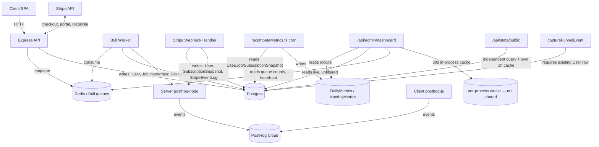

# IMPLEMENTATION_MASTER_PLAN.md — VideoText Analytics Migration

Status: design/blueprint only. No code, migrations, or PRs generated. This is the
anchor document for Phase 3; SPRINT_PLAN.md, DATABASE_MIGRATION_PLAN.md, and the
other 10 deliverables all reference the issue list and dependency graph defined
here.

---

## Part 1 — Current State

### 1.1 Current architecture, in one paragraph

Express monolith (`server/src/index.ts`) + a Bull/Redis worker in the same
codebase, Postgres via Prisma (`server/src/db.ts`), single-VM deployment. The
founder dashboard (`GET /api/admin/dashboard`) computes ~20 aggregates per
request via raw `$queryRaw` against live tables, cached 30s in an in-process
(non-shared) variable. `DailyMetrics`/`MonthlyMetrics` are precomputed hourly/
nightly by `recomputeMetrics.ts` from raw `User`/`Job`/`SubscriptionSnapshot`
tables with no taxonomy filtering. Stripe webhooks write directly into `User`
and an append-only `SubscriptionSnapshot` table. PostHog runs as two
independent, uncoordinated SDK instances (client `posthog-js`, server
`posthog-node`), alongside a separate Postgres `EventLog` fed by
`captureFunnelEvent()`. No automated reconciliation exists between Postgres,
Stripe, and PostHog today.

### 1.2 Issue register (from Phase 1 audit)

| # | Issue | Class | Business Impact | Technical Risk | Eng. Effort |
|---|---|---|---|---|---|
| 1 | MRR computed by summing an append-only `SubscriptionSnapshot` ledger with no dedup — long-tenured subscribers counted once per renewal invoice | **Critical** | Investor/pricing/hiring decisions made off an inflated headline number | Low to fix (isolated query), but touches revenue-critical code — needs a safety net before cutover | Small |
| 2 | `POST /api/auth/demo` creates permanent, uncapped `plan:'pro'` `User` rows with no cleanup | **Critical** | Inflates "paid conversion rate" and plan distribution with $0-revenue accounts | Low | Small–Medium |
| 3 | Three incompatible definitions of "paid user" across the codebase (`User.plan`, `hasPaidAccess()`, Stripe's own subscription list) | High | ARPU/conversion numbers can't be trusted to mean the same thing twice | Low | Medium |
| 4 | Guests counted in `activeUsers` (Job-table) but absent from `totalUsers` (User-table) — numerator not a subset of denominator | High | DAU/MAU and engagement ratios are structurally invalid | Low | Medium (needs anonymous-id work) |
| 5 | Two independent job-state ledgers (Bull/Redis vs. Postgres `Job`), analytics writes are non-blocking and can silently fail | Medium | Job/processing KPIs can silently undercount with no alert | Medium (touches worker hot path) | Medium |
| 6 | `captureFunnelEvent()` requires an existing `User` row — drops all pre-signup funnel events | Medium | Postgres funnel numbers understate top-of-funnel vs. PostHog | Low | Medium |
| 7 | Dashboard cache is a per-process in-memory variable, not shared | Low today / Medium if scaled to >1 API replica | Different founders (or the same one) can see different numbers within 30s | Low | Small |
| 8 | Client PostHog opt-out on ad-block detection creates non-random sampling bias | Low–Medium (inherent to any client analytics) | Early-funnel PostHog numbers skew away from privacy-conscious segments | N/A (informational) | Small (document) / Medium (server-side backstop) |
| 9 | Dashboard trend charts format UTC dates with implicit browser-local timezone | Low | Chart date labels can be off by a day for non-UTC viewers | Low | Small |
| 10 | Deleting a test/demo user does not retroactively correct historical `DailyMetrics`/`MonthlyMetrics` rows | Medium | Historical trend charts silently stay inflated after cleanup | Low | Medium |
| 11 | No automated reconciliation between Postgres and Stripe exists today | High | Every finding above can recur silently, forever, with nothing to catch it | Low to build | Medium |
| 12 | Founder/internal test usage pollutes job/feedback/event aggregates | Medium | Skews activation/engagement numbers by an unknown, unbounded amount | Low | Small (once taxonomy exists) |
| 13 | `getGrowthMetrics()` runs a 6-way live join with heavy window functions on every uncached dashboard hit | Medium (operational) | DB load risk under dashboard traffic growth; also a correctness risk since it's unfiltered | Medium | Medium |
| 14 | `GET /api/stats/public` independently computes totals with its own 1-hour cache — a third, unreconciled metric surface | Low–Medium | Public trust badge can disagree with the founder dashboard's own numbers | Low | Small |

---

## Part 2 — Dependency Graph

### 2.1 Coupling analysis

| Component | Depends on | Consumers that break if it changes shape |
|---|---|---|
| `User` table | — (root) | Upload routes, billing, auth, admin dashboard, recompute cron, funnel events — **the single most coupled table in the system** |
| `SubscriptionSnapshot` | Stripe webhook writes | `recomputeMetrics.ts` (correctly bracketed), dashboard's realtime MRR override (incorrectly unbracketed) — **two readers with different, incompatible assumptions about the same table** |
| `Job` table | Worker writes, upload route inserts | `recomputeMetrics.ts`, dashboard (multiple independent queries), `publicStats` |
| `DailyMetrics`/`MonthlyMetrics` | `recomputeMetrics.ts` only | Dashboard trend charts |
| Dashboard endpoint | `DailyMetrics`, live `User`/`Job`/`SubscriptionSnapshot`/`Feedback`, Redis, in-process cache | Founder Dashboard UI (`client/src/pages/founder/*`) — **any response-shape change requires coordinated frontend deploy** |
| PostHog (client+server) | Independent of Postgres entirely | Nothing in Postgres depends on PostHog; PostHog is a leaf node today (which is good — it means PostHog work is low-coordination) |

### 2.2 What can change independently vs. what requires coordination

| Independent (no coordination needed) | Requires coordination |
|---|---|
| PostHog event-taxonomy cleanup (client + server config) | Any schema change to `User` (touches ~8 route files) |
| `publicStats` endpoint internal fix | Any schema/semantics change to `SubscriptionSnapshot` (3 independent readers must agree or move together via a compatibility layer) |
| Timezone/display fix (client-only, `DailyTrendCharts.tsx`) | Dashboard response-shape changes (frontend + backend must deploy together, or backend must stay backwards-compatible) |
| Adding new, read-only validation/reconciliation jobs (additive, cannot regress anything) | Any change to the worker's job-completion write path (touches the hot path serving real user traffic) |
| Documentation and ADRs | Cache-layer change (per-process → Redis) if done alongside a dashboard refactor (safer to do as its own isolated step first) |
| New `business_*` tables/views (additive, unread by existing code until explicitly wired in) | Cutting the dashboard over to read from `business_*` (must be feature-flagged, not a big-bang swap) |

---

## Part 3 — Independent Workstreams

| Workstream | Goal | Independently deployable? | Depends on | Blocks |
|---|---|---|---|---|
| **WS1 — User Taxonomy** | Add `user_class`/`is_founder`/`is_internal`/`is_developer`/`is_qa`/`is_demo`/`is_bot`/`is_deleted`/`include_in_business_metrics` columns to `User`; backfill known demo/founder/test accounts | Yes — purely additive, no existing query behavior changes until consumed | None | WS2, WS4 (partially), WS9 |
| **WS2 — Canonical Metrics (`business_*` views)** | Stand up `business_users`, `business_jobs`, `business_subscriptions`, etc. as views/tables reading the taxonomy | Yes — new objects, nothing reads them yet | WS1 | WS7, WS8 |
| **WS3 — MRR Fix** | Deduplicate subscription "current state" from the append-only ledger | Yes — isolated query change behind a flag | None (can run in parallel with WS1) | WS5 |
| **WS4 — Dashboard Migration** | Cut dashboard cards over to canonical sources, card by card | No, per-card cutover requires WS2/WS3 outputs to exist first for that card | WS1, WS2, WS3 | — |
| **WS5 — Stripe Reconciliation** | Nightly job comparing canonical MRR/customers/revenue to live Stripe | Yes | WS3 | Ongoing safety net for all revenue work |
| **WS6 — PostHog Cleanup** | Event taxonomy, ownership boundaries, server-side backstop for funnel steps | Yes — no DB dependency | None | — |
| **WS7 — Rollups Redesign** | `DailyMetrics`/`MonthlyMetrics` read only from `business_*`, add `metric_version` | No — needs WS2 first | WS2 | WS4 (trend cards) |
| **WS8 — Metrics API** | Single `GET /api/metrics/:name` contract | No — needs something to serve | WS2, WS7 | Future consumers (Claude analysis, ad hoc tools) |
| **WS9 — Validation** | Automated reconciliation/integrity jobs (Part 10) | Partially yes — a subset can run against *today's* schema immediately to quantify problems before any fix ships | Grows incrementally with WS1–WS7 | Provides go/no-go gate for every cutover |
| **WS10 — Documentation** | ADRs, dictionaries, runbooks | Yes — zero technical dependency, can start immediately | None | — |
| **WS11 — Governance** | RFC process, metric versioning, review cadence | Yes — process-only | None | Long-term consistency of everything above |
